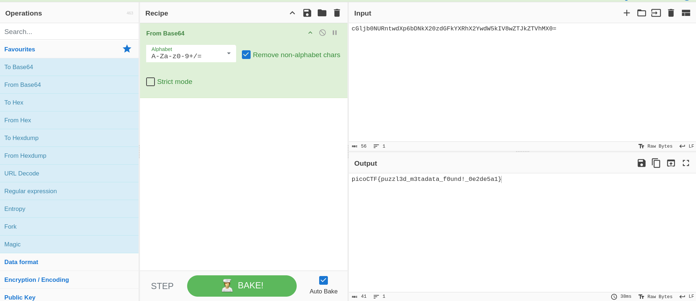

# PicoCTF Walkthrough: Riddle Registry

## Description of the challenge

Hi, intrepid investigator! 📄🔍 You've stumbled upon a peculiar PDF filled with what seems like nothing more than garbled nonsense. But beware! Not everything is as it appears. Amidst the chaos lies a hidden treasure—an elusive flag waiting to be uncovered.

Find the PDF file here: **Hidden Confidential Document** and uncover the flag within the metadata.

## Step 1 — Inspecting the File With `exiftool`

We started by running  ``exiftool``, which is a common metadata inspection tool. It can read metadata fields from many file formats (images, documents, etc.).

The command we used:

```
exiftool <filename>
```

When the output appeared, one important metadata field stood out — the **Author** field. Instead of a normal name, it contained a long string which showed signs of being encrypted.


This clearly suggested the hidden flag (or part of it) was encoded inside the metadata.

---

## Step 2 — Copying the Author Metadata Value

Copy the entire string and move on to the next step since nothing of high relevance was there in the other metadata fields pointing towards an anomaly that was supposed to be assessed.  

---

## Step 3 — Decoding String on CyberChef

Next, we open **CyberChef**, which is an online data transformation tool useful for encoding/decoding tasks.

### Steps to be Followed

1. Open CyberChef.
2. Paste the string from the Author field.
3. Apply the **"From Base64"** operation.
4. Run the recipe.

CyberChef output the decoded text — which was the **actual PicoCTF flag**.



The process required no extra manipulation: simple Base64 decoding was enough.

---

## Final Flag

After decoding, the output revealed the full challenge flag in the standard PicoCTF format:

```
picoCTF{...}
```

---

## Summary

We solved the challenge in the following steps:

1. **Used exiftool** to inspect metadata.
2. **Found an encrypted string** in the Author field.
3. **Copied the string** into CyberChef.
4. **Decoded it using From Base64**.
5. Retrieved the **final PicoCTF flag**.

---

**End of walkthrough**
