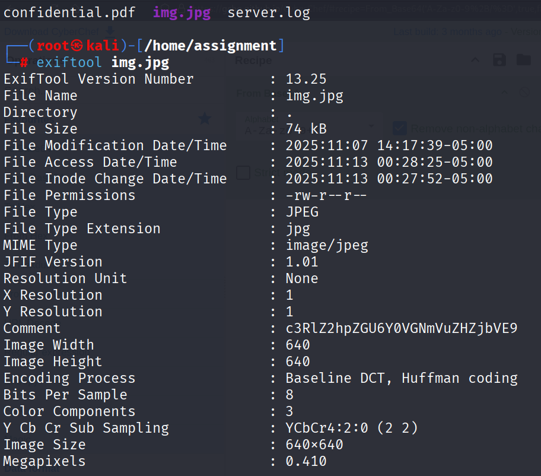
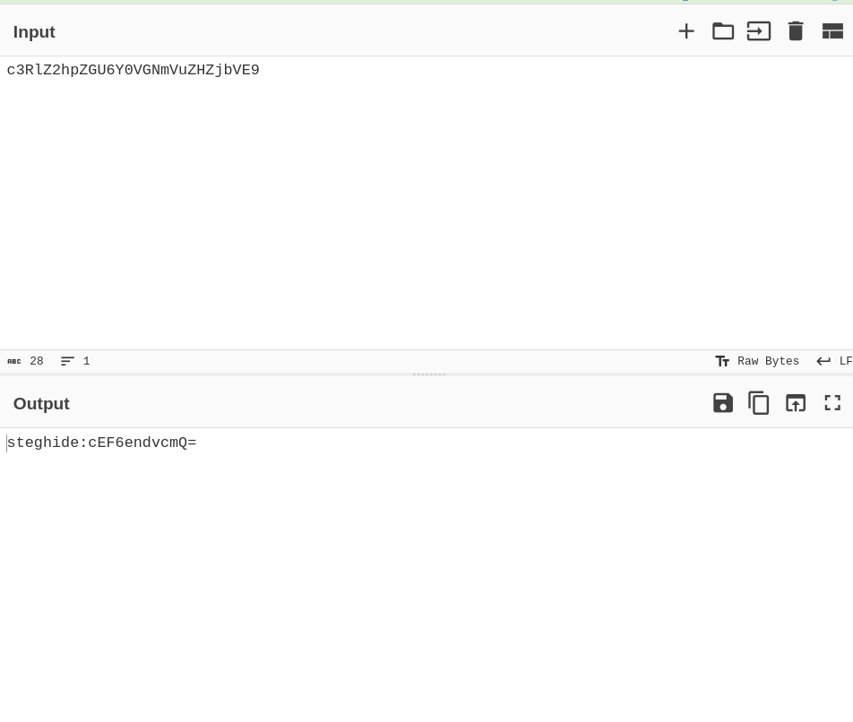
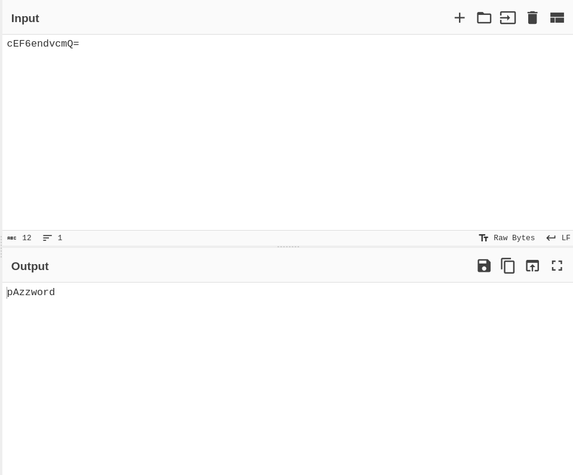
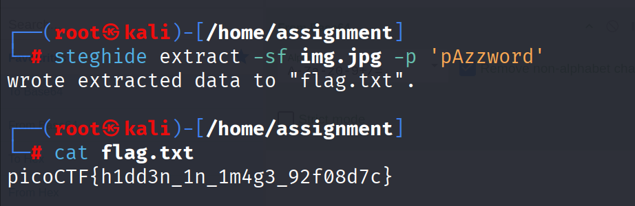

# PicoCTF Walkthrough: Hidden JPG Payload

## Description of the challenge

You're given a JPG image that contains hidden data. By inspecting the metadata and decoding an embedded comment, you can extract the password needed to unlock the hidden payload inside the image.

---

#### FIle provided:


## Step 1 — Checking the Metadata With `exiftool`

We begin by inspecting the JPG image:

```
exiftool img.jpg
```

The output reveals that the **Comment** field contains a suspicious encoded string.  



---

## Step 2 — Decoding the Comment on CyberChef

Copy the string from the Comment field into CyberChef and decode it.

This reveals a new Base64 segment prefixed with `steghide:`.  



Decode the second Base64 string which reveals the password:

```
pAzzword
```



---

## Step 3 — Extracting the Hidden Payload With `steghide`

Use the recovered password with `steghide` to extract hidden data from the image:

```
steghide extract -sf img.jpg -p 'pAzzword'
```

The tool extracts a file called **flag.txt**.

Open it:

```
cat flag.txt
```

You will see the final PicoCTF flag.  



---

## Final Flag

```
picoCTF{h1dd3n_1n_1m4g3_92f08d7c}
```

---

## Summary

1. **Used `exiftool`** to inspect metadata.  
2. Found an **encoded string in the metadata**.  
3. **Decoded it twice** in CyberChef to obtain the password.  
4. **Used steghide** with the password to extract `flag.txt`.  
5. Retrieved the PicoCTF flag.

---

**End of walkthrough**
