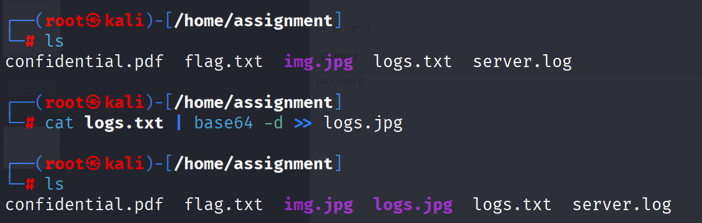

# PicoCTF Walkthrough: Flag in Flame

## Description of the challenge

The SOC team discovered a suspiciously large log file after a recent breach. When they opened it, they found an enormous block of encoded text instead of typical logs. Could there be something hidden within? Your mission is to inspect the resulting file and reveal the real purpose of it. The team is relying on your skills to uncover any concealed information within this unusual log.
Download the encoded data here: Logs Data. Be prepared—the file is large, and examining it thoroughly is crucial .

---

## Step 1 — Decoding the Encoded Logs

The file `logs.txt` is fully Base64-encoded.  
Decode it directly into a JPG file:

```
cat logs.txt | base64 -d >> logs.jpg
```

Once decoded, a new file named `logs.jpg` appears in the directory.


---

## Step 2 — Inspecting the Decoded Image

Opening `logs.jpg` reveals an illustration with a **long hexadecimal string** hidden along the bottom edge.


---

## Step 3 — Decoding the Hex String Using CyberChef

Copy the hex string from the bottom of the image and paste it into **CyberChef**.

Once pasted, we work our way towards detecting the encryption used on the string. Once we figure that out, we continue with the ``hex`` option and decode the string.

CyberChef outputs the hidden message — including the PicoCTF flag.

---

## Final Flag

```
picoCTF{<your_decoded_flag>}
```

---

## Summary

1. **Base64-decoded** the entire log file into `logs.jpg`.  
2. Found a **hex-encoded message** inside the image.  
3. **Used CyberChef** to decode the string.  
4. Retrieved the final PicoCTF flag.

---

**End of walkthrough**
