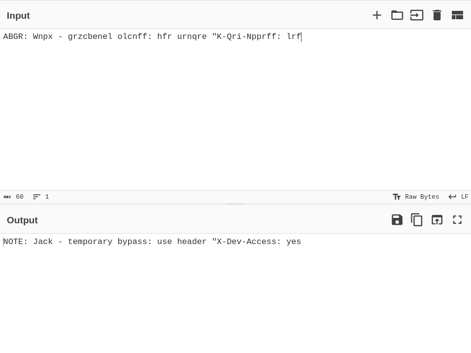
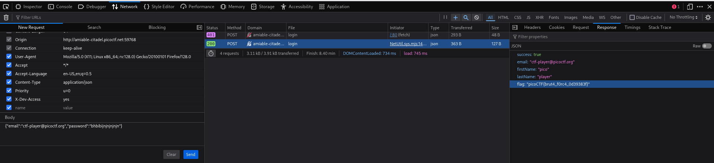

# PicoCTF Walkthrough: Crack the Gate 1

## Description of the challenge

We’re in the middle of an investigation. One of our persons of interest, ctf player, is believed to be hiding sensitive data inside a restricted web portal. We’ve uncovered the email address he uses to log in: ctf-player@picoctf.org. Unfortunately, we don’t know the password, and the usual guessing techniques haven’t worked. But something feels off... it’s almost like the developer left a secret way in. Can you figure it out?
Additional details will be available after launching your challenge instance.

---

## Step 1 — Inspecting the Developer Message

When the challenge loads, it displays an encoded note.  
Paste the message into **CyberChef** and decode the questionable string.

The decoded output reveals a hidden developer comment:

```
NOTE: Jack – temporary bypass: use header "X-Dev-Access: yes"
```



---

## Step 2 — Sending a Request With the Hidden Header

Open the browser’s **Developer Tools → Network → New Request** panel.

Add the required header:

```
X-Dev-Access: yes
```

Fill in the login body with the known email and use anything (yes, even gibberish works) for the password's field:

```
{
  "email": "ctf-player@picoctf.org",
  "password": "random123"
}
```

Send the request.



---

## Step 3 — Retrieving the Flag

The server accepts the request because of the secret header.  
The response returns user information — and the PicoCTF flag:

```
"flag": "picoCTF{....}"
```

---

## Final Flag

```
picoCTF{brut4_forc4_0d39383f}
```

---

## Summary

1. **Decoded** the developer message using ROT13.  
2. Found a **secret bypass header**: `X-Dev-Access: yes`.  
3. Sent a login request with the hidden header.  
4. The server returned the PicoCTF flag.

---

**End of walkthrough**
