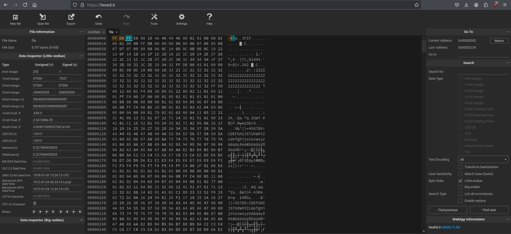

# PicoCTF Walkthrough: Corrupted File 

## Description of the Challenge

This file seems broken... or is it? Maybe a couple of bytes could make all the difference. Can you figure out how to bring it back to life?
Download the file here.

---

## Step 1 — Inspecting the File in a Hex Editor — Checking the File Type

To begin our investigation, we load the provided file into a hex editor. The description suggests corruption, so we immediately inspect its magic bytes.
After downloading the provided file, opening it normally does not work. Since the challenge hints at corrupted bytes, we load it into a hex editor.

###  Initial Google Search: JPEG Magic Bytes


A quick search confirms that proper JPEG files start with the magic bytes:

```
FF D8 FF
```

---

## Step 2 — Identifying Expected JPEG Magic Bytes

Next, we open the file in **hexed.it** to confirm whether the header matches what we expect.
Load the corrupted file into **hexed.it** to inspect the header.

### File Appears With Wrong Header Bytes



At the start of the file you can see incorrect or missing JPEG start bytes. 

---

## Step 3 — Fixing the Corrupted Header Bytes

Inside the hex editor, the beginning of the file does not contain the proper JPEG identification bytes. To revive the file, we manually correct the first bytes to:

```
FF D8 FF
```

Replace the incorrect starting bytes with:

```
FF D8 FF 
```

This restores a valid JPEG header.

After correcting the bytes, export the repaired file.

---

## Step 4 — Restoring and Opening the File

Once the bytes are corrected, we export the repaired file. Now the image opens cleanly—revealing the hidden flag!
Once exported, the file successfully opens as an image.

###  Recovered Image Containing the Flag


The image displays the final PicoCTF flag.

```
picoCTF{r3st0r1ng_th3_by73s_ef8d86c0}
```

---

## Summary

1. Loaded the corrupted file into a hex editor.
2. Identified missing/corrupted JPEG magic bytes.
3. Corrected the header to valid JPEG starting bytes.
4. Exported and opened the restored image.
5. Retrieved the PicoCTF flag hidden inside the recovered file.

---

**End of walkthrough**
