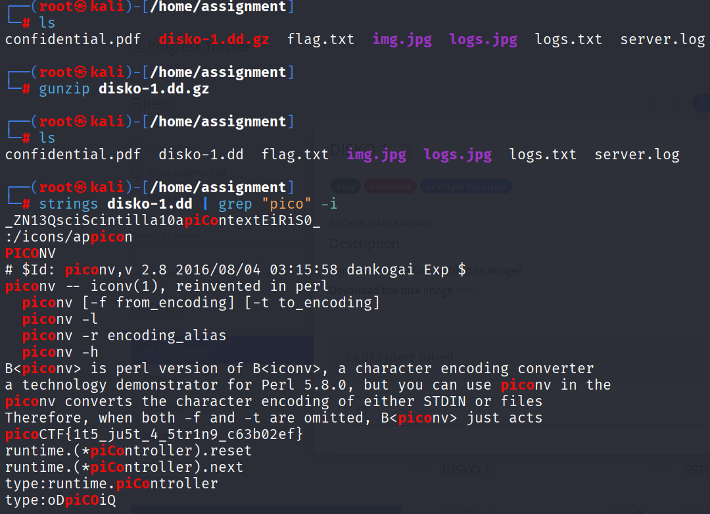

# PicoCTF Walkthrough: DISKO 1

## Description of the challenge

Can you find the flag in this disk image?
Download the disk image here.

---

## Step 1 — Extracting the Disk Image

After downloading the challenge file (`disko-1.dd.gz`), begin by decompressing it:

```
gunzip disko-1.dd.gz
```

A new raw disk image file, `disko-1.dd`, is created.

> A .dd file is a raw disk image — a bit-for-bit copy of a storage device. It contains all data, including deleted or hidden content, making it useful for forensic analysis.

---

## Step 2 — Searching for the Flag Inside the Disk

Use the `strings` command to extract readable ASCII text from the disk image, then pipe it into `grep` to filter for PicoCTF:

```
strings disko-1.dd | grep "pico" -i
```

This scans the entire disk and returns any lines containing “pico”.

Among the output, the full PicoCTF flag appears clearly in one of the strings.



---

## Final Flag

```
picoCTF{it5_ju5t_4_5t1rn9_c63b02ef}
```

---

## Summary

1. **Decompressed** the disk image using `gunzip`.  
2. **Searched** the raw disk file with `strings` + `grep`.  
3. Located a **clear-text flag** embedded directly inside the disk data.  
4. Retrieved the final PicoCTF flag.

---

**End of walkthrough**
